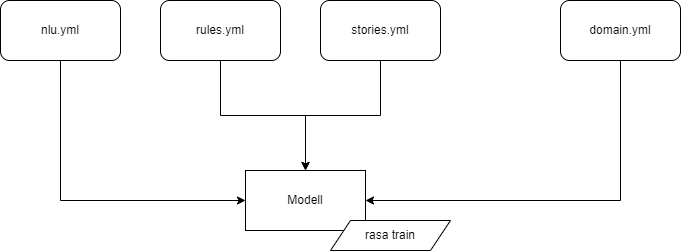

# Chatbot mit Rasa Intro.

## Setup


1. Virtual Environment erstellen und aktivieren
#### MacOS (funktioniert **nicht** auf Apple Silicon,  TODO: M1, M2 Mac)
```
python -m venv rasa-venv
source rasa-venv/bin/activate
```
#### Windows (CMD)
```
python3 -m venv rasa-venv
rasa-env\Scripts\activate.bat
```
#### Windows (Git Bash)
```
python3 -m venv rasa-venv
source ./rasa-env/Scripts/activate
```

2. Installiere Rasa
```
python -m pip install rasa
```

3. Initialisieren von Rasa
```
python -m rasa init
```
Bei Frage nach Projektpfad ```Yes```  (aktueller Pfad).
Bei Frage, ob ein initiales Modell trainiert worden, ebenfalls ```Yes```.

## Erster Start des Chatbots
```
rasa shell
```

Starten des Chatbots mit Debug Info des Modell-Output:
```
rasa shell nlu
```

### Netz trainieren
```
rasa train
```
(später interessant, wenn die Config-files geändert werden)

## Die wichtigsten Config-files



## nlu.yml

Enthält **Intents** und **Examples**. Fürs Erste: Intents sind Gruppen von
Aufforderungen bzw. Fragen des Users an den Chatbot. Zum Beispiel:

```yml
- intent: mood_great
  examples: |
    - perfect
    - great
    - amazing
    - feeling like a king
    - wonderful
    - I am feeling very good
    - I am great
    - I am amazing
    - I am going to save the world
    - super stoked
    - extremely good
    - so so perfect
    - so good
    - so perfect
```

## stories.yml

Stellt man sich die **Intents** als Legosteine vor, dann besteht eine **Story**
aus mehreren Steinen: Intents werden aufeinandergesteckt, wodurch eine
Sequenz aus **Intents** und **Actions** entsteht. Bsp:

```yml
- story: happy path
  steps:
  - intent: greet
  - action: utter_greet
  - intent: mood_great
  - action: utter_happy
```


